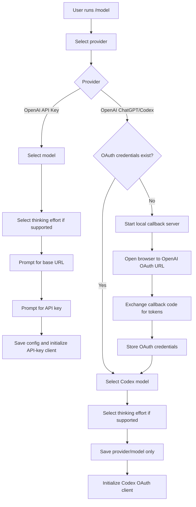
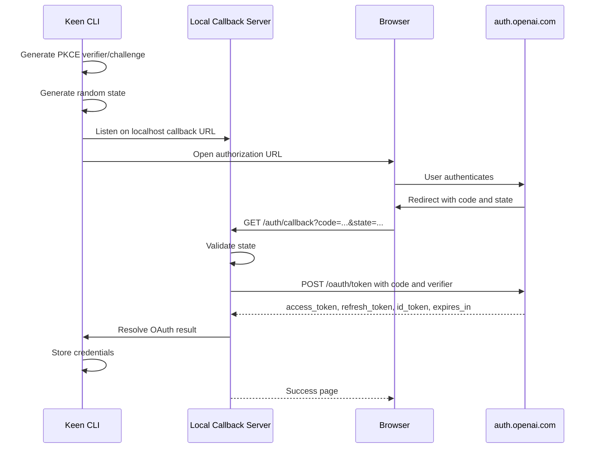
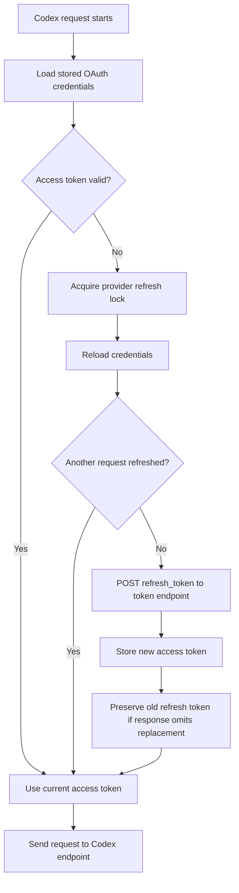

# RFC: ChatGPT Account OAuth Support for OpenAI Codex Models

## Status

Draft.

## Summary

Keen Code currently supports OpenAI through API-key authentication against the OpenAI Responses API. This RFC proposes adding a separate provider path for users who want to authenticate with a ChatGPT account through browser OAuth and use the ChatGPT/Codex model endpoint without entering an API key or base URL.

The new provider should be presented as:

- `OpenAI` for the existing OpenAI Platform API-key flow.
- `Codex (ChatGPT OAuth)` for browser-based ChatGPT account OAuth.

The ChatGPT/Codex flow is not a normal OpenAI API-key variant. It uses a different credential lifecycle, request endpoint, request headers, model list, and user-facing setup flow. The implementation should keep it separate from the current `openai` provider instead of forcing OAuth into the existing `ProviderConfig.APIKey` field.

## Goals

- Add browser-only OAuth login for ChatGPT accounts.
- Let users select `Codex (ChatGPT OAuth)` from `/model`.
- Open the default browser to authenticate with OpenAI.
- Show a local browser success page after authentication finishes.
- Return the user to the CLI and continue to model selection.
- Skip API key and base URL prompts for the ChatGPT/Codex provider.
- Store OAuth tokens locally with file permissions appropriate for secrets.
- Refresh access tokens automatically.
- Use the Codex responses endpoint for ChatGPT/Codex traffic.
- Keep existing OpenAI API-key behavior unchanged.

## Non-Goals

- No headless/device-code login flow in the initial implementation.
- No ChatGPT web session scraping.
- No reuse of ChatGPT OAuth credentials against arbitrary OpenAI Platform endpoints.
- No changes to existing non-OpenAI providers.
- No automatic migration of existing `openai` API-key configuration to ChatGPT/Codex.

## Current State

Keen Code currently has these relevant boundaries:

- Provider metadata is embedded from `providers/registry.yaml`.
- `internal/config.ProviderConfig` stores `Models`, `APIKey`, and optional `BaseURL`.
- `config.Resolve` requires an API key for all configured providers.
- `llm.NewClient` rejects configs with an empty API key.
- `/model` is implemented in `internal/cli/repl/widgets/model_selection.go`.
- The model selection widget currently prompts for model, thinking effort, optional base URL, and API key.
- The existing OpenAI client is `OpenAIResponsesClient`, backed by `github.com/openai/openai-go`.

Those assumptions fit API-key providers. They do not fit ChatGPT/Codex OAuth cleanly.

## Proposed Design

Add a separate provider ID:

```text
openai-codex
```

Display it as:

```text
Codex (ChatGPT OAuth)
```

Keep the existing `openai` provider but rename its display name to:

```text
OpenAI
```

The new provider has:

- no base URL prompt
- no API key prompt
- browser OAuth before model selection when credentials are missing or invalid
- its own token storage
- its own LLM client implementation
- its own static model list

## User Experience

### First-Time Setup

1. User runs Keen Code or enters `/model`.
2. User selects `Codex (ChatGPT OAuth)`.
3. If no valid OAuth credentials exist, Keen Code starts a temporary localhost callback server.
4. Keen Code opens the OAuth URL in the default browser.
5. User authenticates with their OpenAI/ChatGPT account.
6. Browser redirects to the local callback URL.
7. Keen Code validates state, exchanges the code for tokens, stores credentials, then returns a success page.
8. User returns to the CLI.
9. Keen Code shows the static supported ChatGPT/Codex model list.
10. User selects a model and thinking effort when that model supports configurable effort.
11. Keen Code saves the selected provider/model and initializes the LLM client.

### Returning Setup

If valid OAuth credentials already exist:

1. User selects `Codex (ChatGPT OAuth)`.
2. Keen Code skips login.
3. Keen Code shows the static ChatGPT/Codex model list.
4. User selects a model and thinking effort when that model supports configurable effort.

If credentials exist but the access token is expired, model selection can continue. The LLM client should refresh the access token before the next request.

## Provider Selection Flow



## OAuth Flow

The browser login should use Authorization Code with PKCE.

Suggested constants, matching the Codex-style flow used by OpenCode:

```text
issuer: https://auth.openai.com
client_id: app_EMoamEEZ73f0CkXaXp7hrann
scope: openid profile email offline_access
redirect_uri: http://localhost:<port>/auth/callback
authorization flags:
  id_token_add_organizations=true
  codex_cli_simplified_flow=true
  originator=keen-code
```

The port can be fixed or dynamic. A dynamic port avoids collisions, but the redirect URI must be accepted by the OpenAI OAuth client. If only a known localhost port works for this client, use that port and handle conflicts explicitly.

### OAuth Sequence



### Important Callback Rules

The callback handler should be stricter than the OpenCode implementation reviewed for this issue:

- Validate `state` before handling success or error outcomes.
- Do not reflect raw `error` or `error_description` into HTML.
- Exchange tokens before showing the browser success page.
- Show an error page if token exchange fails.
- Stop the local HTTP server in a `defer` or `finally` equivalent for success, cancel, timeout, and failure.
- Time out the pending login after a fixed duration, for example five minutes.

## Token Storage

Add a separate auth store instead of placing OAuth material inside provider config.

Suggested file:

```text
~/.keen/auth.json
```

Suggested shape:

```json
{
  "openai-codex": {
    "type": "oauth",
    "access_token": "...",
    "refresh_token": "...",
    "expires_at": "2026-04-27T12:00:00Z",
    "account_id": "optional ChatGPT account or organization id"
  }
}
```

The file should be written with `0600` permissions. The code should avoid logging tokens, authorization codes, full callback URLs, or OAuth response bodies.

### Token Claims

Extract `account_id` from the ID token first, then access token as a fallback. Known claim locations from OpenCode:

```text
chatgpt_account_id
https://api.openai.com/auth.chatgpt_account_id
organizations[0].id
```

JWT parsing here is only for claim extraction, not for validating trust. The access token is trusted because it came directly from the token endpoint over TLS.

## Refresh Flow

Access tokens should be refreshed lazily before requests when expired or near expiry.



Refresh should be guarded by a per-provider mutex to avoid concurrent refreshes racing against each other. This matters if refresh tokens rotate.

## Request Path

The ChatGPT/Codex client should send Responses-compatible requests to:

```text
https://chatgpt.com/backend-api/codex/responses
```

Required headers:

```text
Authorization: Bearer <access_token>
ChatGPT-Account-Id: <account_id>   # only when known
originator: keen-code
User-Agent: keen-code/<version> (<os> <arch>)
session_id: <session id if available>
```

Keen Code should not pass an OpenAI API key for this provider.

## LLM Client Design

Add a new client rather than overloading `OpenAIResponsesClient`:

```text
internal/llm/openai_codex.go
```

The client can share request conversion logic with `OpenAIResponsesClient` where practical:

- message conversion
- tool conversion
- reasoning effort mapping
- streaming event handling
- tool loop behavior

The main differences are:

- auth comes from OAuth token storage, not `ClientConfig.APIKey`
- endpoint is the ChatGPT Codex endpoint
- refresh is required before requests
- custom headers are required
- base URL is not configurable

The current Keen Code dependency, `github.com/openai/openai-go v1.8.2`, can target the Codex endpoint cleanly enough to use for the first implementation. `client.Responses.NewStreaming` posts to the relative path `responses`, and `option.WithBaseURL("https://chatgpt.com/backend-api/codex/")` resolves that request to `https://chatgpt.com/backend-api/codex/responses`.

The Codex client should therefore keep using `openai-go` response parameter types, streaming decoding, and response event types. It should not use a dummy API key. Instead, refresh OAuth credentials before each request as needed and pass request-specific headers:

```go
stream := c.client.Responses.NewStreaming(ctx, params,
    option.WithHeader("authorization", "Bearer "+accessToken),
    option.WithHeader("originator", "keen-code"),
    option.WithHeader("User-Agent", userAgent),
)
```

When `accountID` is known, add:

```go
option.WithHeader("ChatGPT-Account-Id", accountID)
```

Because `openai.NewClient` reads `OPENAI_API_KEY`, `OPENAI_ORG_ID`, and `OPENAI_PROJECT_ID` from the environment by default, the Codex client should explicitly override the authorization header per request and avoid passing OpenAI Platform organization/project headers to the ChatGPT/Codex endpoint. If those environment-derived headers are present, remove them with request options such as `option.WithHeaderDel("OpenAI-Organization")` and `option.WithHeaderDel("OpenAI-Project")`, or construct the service in a way that avoids default environment options if the SDK exposes that in a future version.

## Config Changes

Current provider config:

```go
type ProviderConfig struct {
    Models  []string
    APIKey  string
    BaseURL string
}
```

Proposed direction:

- Keep `ProviderConfig` for API-key providers.
- Add provider metadata or helper functions that identify auth requirements.
- Add a separate `AuthStore` for OAuth credentials.
- Allow `config.Resolve` and `llm.NewClient` to resolve `openai-codex` without an API key.

Possible resolved config extension:

```go
type ResolvedConfig struct {
    Provider       string
    APIKey         string
    Model          string
    ThinkingEffort string
    BaseURL        string
    AuthMode       string
}
```

For `openai-codex`, `AuthMode` would be `oauth`, `APIKey` would be empty, and the LLM client would load OAuth credentials from the auth store.

## Provider Registry Changes

Add a separate static provider entry to `providers/registry.yaml`. Keen Code should not discover these models dynamically from the ChatGPT/Codex endpoint in the initial implementation.

```yaml
- id: openai-codex
  name: Codex (ChatGPT OAuth)
  models:
    - id: gpt-5.5
      name: GPT-5.5
      context_window: 1050000
      thinking_efforts: ["low", "medium", "high", "xhigh"]
    - id: gpt-5.4
      name: GPT-5.4
      context_window: 1050000
      thinking_efforts: ["low", "medium", "high", "xhigh"]
    - id: gpt-5.3-codex
      name: GPT-5.3 Codex
      context_window: 400000
      thinking_efforts: ["low", "medium", "high", "xhigh"]
```

Initial supported models:

- `gpt-5.5`
- `gpt-5.4`
- `gpt-5.3-codex`

Model metadata to use:

| Model | API context window | ChatGPT-account conservative registry context window | Known higher tier window | Max output | Thinking efforts |
| --- | ---: | ---: | --- | ---: | --- |
| `gpt-5.5` | 1,050,000 | 256,000 | Pro: 400,000 | 128,000 | `low`, `medium`, `high`, `xhigh` |
| `gpt-5.4` | 1,050,000 | 256,000 | Pro: 400,000 | 128,000 | `low`, `medium`, `high`, `xhigh` |
| `gpt-5.3-codex` | 400,000 | 400,000 | Unknown | 128,000 | `low`, `medium`, `high`, `xhigh` |

The `gpt-5.5` and `gpt-5.4` registry context windows intentionally differ from the public API context windows. This provider authenticates with ChatGPT accounts, not API organizations. OpenAI's ChatGPT help docs list Thinking context as `256K` for all paid tiers and `400k` for Pro. Because Keen Code's provider registry is currently static and does not detect the signed-in plan, the first implementation should use the conservative `256000` context window for GPT-5.5 and GPT-5.4. A later enhancement can raise the displayed window to `400000` after detecting a Pro account.

`gpt-5.3-codex` remains `400000` because the official GPT-5.3-Codex model page lists a 400,000-token context window, and OpenCode's model metadata for the OpenAI provider uses `400000` context, `272000` input, and `128000` output. If real ChatGPT/Codex OAuth testing shows a lower Plus limit for this specific Codex model, the static registry should be reduced to that lower value.

The ChatGPT/Codex provider should not expose `off` or `none` in the initial implementation. Users should choose an active reasoning effort from `low` upward. This keeps the UX consistent across the supported ChatGPT/Codex models and avoids ambiguity between OpenAI's API-level `none` value and Keen Code's existing `off` convention, which means "omit the reasoning parameter."

OpenCode handles supported OAuth models by starting from its normal OpenAI catalog and filtering it with a hardcoded allowlist plus Codex-name matching. Keen Code's registry is simpler, so a separate static `openai-codex` provider list is clearer and easier to test.

Rename existing OpenAI display name:

```yaml
- id: openai
  name: OpenAI
```

## REPL Model Selection Changes

The model selection widget needs to branch on provider auth type.

For API-key providers:

```text
Provider -> Model -> Thinking -> Base URL if supported -> API Key -> Complete
```

For ChatGPT/Codex:

```text
Provider -> OAuth if needed -> Model -> Thinking -> Complete
```

This likely requires a new model-selection step:

```go
StepOAuth
```

However, OAuth includes asynchronous work and browser launch. It may be cleaner to trigger OAuth as a `tea.Cmd` after selecting the provider, then return to the model list on success.

The widget should render clear CLI text while waiting:

```text
Opening your browser to sign in with OpenAI...

After authentication succeeds, return to Keen Code.
```

If opening the browser fails, print the URL and ask the user to open it manually.

## Browser Opening

Use OS-specific commands:

- macOS: `open <url>`
- Linux: `xdg-open <url>`
- Windows: `rundll32 url.dll,FileProtocolHandler <url>` or equivalent

The browser command should not block the REPL. Failure to launch should not fail the flow if the URL can be displayed.

## Error Handling

Expected user-facing errors:

- OAuth port unavailable.
- Browser launch failed; URL shown for manual opening.
- Login timed out.
- User denied or canceled authorization.
- OAuth callback state mismatch.
- Token exchange failed.
- Token refresh failed.
- Account lacks access to the selected model.
- Codex endpoint returns unauthorized or forbidden.

For refresh failures, Keen Code should surface a clear message suggesting re-authentication.

## Security Considerations

- Generate high-entropy PKCE verifier and state.
- Bind callback handling to the pending state.
- Prefer `localhost` loopback only.
- Store tokens with `0600` permissions.
- Do not print tokens, auth codes, or callback URLs with query strings in logs.
- HTML-escape browser error text.
- Stop the local callback server after each attempt.
- Guard token refresh with a mutex.
- Preserve old refresh token if refresh response does not include a new one.
- Treat OAuth credentials separately from API keys to avoid accidental exposure in config views.

## Compatibility and Migration

No migration is required for existing users.

Existing users keep:

```text
openai -> OpenAI
```

New users can choose:

```text
openai-codex -> Codex (ChatGPT OAuth)
```

If a user switches between providers, Keen Code should preserve each provider's selected models and credentials independently.

## Testing Strategy

Unit tests:

- PKCE verifier/challenge format.
- State generation length and uniqueness properties.
- JWT account ID extraction.
- Callback handler rejects missing or mismatched state.
- Callback handler escapes error text.
- Token exchange success and failure.
- Token refresh success and failure.
- Refresh preserves old refresh token when omitted.
- Refresh mutex prevents duplicate refresh calls.
- Config resolution allows `openai-codex` without API key.
- Config resolution still rejects missing API keys for API-key providers.
- Model selection skips base URL and API key for `openai-codex`.
- Provider registry includes `openai-codex`.

Integration-style tests with fake HTTP servers:

- Browser OAuth callback succeeds and stores credentials.
- Expired token refreshes before a Codex request.
- Codex request includes Authorization and optional ChatGPT-Account-Id headers.
- Codex request targets `/backend-api/codex/responses`.
- Unauthorized refresh produces a re-authentication error.

Manual tests:

- First-time login on macOS.
- Existing credential reuse.
- Expired credential refresh.
- Browser launch failure fallback by forcing an invalid opener.
- OAuth timeout.
- `/model` switching between API-key OpenAI and ChatGPT/Codex.

## Rollout Plan

1. Add the provider and config/auth primitives behind normal tests.
2. Add OAuth login and storage.
3. Add the Codex LLM client.
4. Wire `/model` to the new flow.
5. Run end-to-end manual login.
6. Update user-facing docs or README.

## Open Questions

- Does the Codex OAuth client accept a dynamic localhost port, or must Keen Code use a fixed callback port?
  - Keen Code should bind localhost:1455, fail with a clear message if unavailable, and not silently pick another port. Since we are not supporting headless, the fallback can simply tell the user to close the app using port 1455 and retry.
- Are `gpt-5.5`, `gpt-5.4`, and `gpt-5.3-codex` all accepted by the ChatGPT/Codex endpoint for the target account plans?
  - Yes.
- Should `openai-codex` selected model history be stored in `ProviderConfig.Models`, or should OAuth providers have a distinct config shape?
  - Existing one is fine.
- Should token storage live in `~/.keen/auth.json` immediately, or should it integrate with OS keychains later?
  - Yes `~/.keen/auth.json` is fine.
- Should Keen Code expose a `/logout` or `/auth` command in the same issue, or leave it for follow-up?
  - We can have a `/logout` command to logout the current user. It should be simple and just remove the auth credentials from the auth file. Perhaps also show a message to the user that the logout is successful.

## Fine-Grained TODO List

### Research and Validation

- [ ] Verify the current Codex OAuth authorization URL parameters against a real browser login.
- [ ] Verify whether `redirect_uri` supports dynamic localhost ports.
- [ ] Verify the exact browser callback path accepted by the OpenAI OAuth client.
- [ ] Verify the current Codex responses endpoint.
- [ ] Verify that `gpt-5.5`, `gpt-5.4`, and `gpt-5.3-codex` work with ChatGPT/Codex auth.
- [ ] Verify whether Plus accounts receive a lower effective context window than Pro accounts.
- [ ] Capture representative unauthorized, forbidden, and rate-limit responses from the Codex endpoint.

### Provider Registry

- [ ] Rename the existing `openai` display name to `OpenAI`.
- [ ] Add `openai-codex` provider to `providers/registry.yaml`.
- [ ] Add static ChatGPT/Codex model entries for `gpt-5.5`, `gpt-5.4`, and `gpt-5.3-codex`.
- [ ] Add or update registry tests for the new provider.
- [ ] Set `gpt-5.5` context window to `256000`.
- [ ] Set `gpt-5.4` context window to `256000`.
- [ ] Set `gpt-5.3-codex` context window to `400000`.
- [ ] Set `gpt-5.5` thinking efforts to `["low", "medium", "high", "xhigh"]`.
- [ ] Set `gpt-5.4` thinking efforts to `["low", "medium", "high", "xhigh"]`.
- [ ] Set `gpt-5.3-codex` thinking efforts to `["low", "medium", "high", "xhigh"]`.

### Auth Storage

- [ ] Add `internal/auth` package or equivalent.
- [ ] Define OAuth credential structs.
- [ ] Add auth file path helper for `~/.keen/auth.json`.
- [ ] Implement auth file load.
- [ ] Implement auth file save with `0600` permissions.
- [ ] Implement auth get/set/remove for provider IDs.
- [ ] Add tests for missing auth file.
- [ ] Add tests for invalid auth file contents.
- [ ] Add tests for file permission behavior where supported.

### OAuth Browser Flow

- [ ] Add PKCE verifier generation.
- [ ] Add PKCE S256 challenge generation.
- [ ] Add state generation.
- [ ] Add authorization URL builder.
- [ ] Add token exchange request.
- [ ] Add token refresh request.
- [ ] Add ID/access token claim parser.
- [ ] Add account ID extraction helper.
- [ ] Add localhost callback server.
- [ ] Validate `state` before handling OAuth success or error.
- [ ] Exchange tokens before returning browser success HTML.
- [ ] HTML-escape error messages.
- [ ] Stop callback server after success.
- [ ] Stop callback server after token exchange failure.
- [ ] Stop callback server after timeout.
- [ ] Add browser opener abstraction.
- [ ] Implement macOS browser opener.
- [ ] Implement Linux browser opener.
- [ ] Implement Windows browser opener.
- [ ] Add fallback that prints URL if browser opening fails.

### Config Resolution

- [ ] Add `ProviderOpenAICodex` constant.
- [ ] Add provider auth-mode helper, for example `RequiresAPIKey(providerID string)`.
- [ ] Update `config.Resolve` to allow `openai-codex` without API key.
- [ ] Preserve API-key requirement for existing providers.
- [ ] Add `AuthMode` or equivalent to `ResolvedConfig` if needed.
- [ ] Update root command config hydration for OAuth provider.
- [ ] Add tests for resolving `openai-codex`.
- [ ] Add regression tests for resolving API-key providers.

### Model Selection UI

- [ ] Add provider helper for OAuth providers.
- [ ] Add model selection branch for `openai-codex`.
- [ ] Trigger OAuth after selecting `openai-codex` when credentials are missing.
- [ ] Skip OAuth when stored credentials exist.
- [ ] Skip base URL input for `openai-codex`.
- [ ] Skip API key input for `openai-codex`.
- [ ] Save selected provider/model/thinking effort after Codex model selection.
- [ ] Render in-progress OAuth status.
- [ ] Render browser-open fallback URL.
- [ ] Render OAuth failure messages.
- [ ] Add tests for provider selection branching.
- [ ] Add tests for paste handling not appending secrets in OAuth mode.
- [ ] Add tests for completion without API key for `openai-codex`.

### LLM Client

- [ ] Add `OpenAICodexClient`.
- [ ] Reuse or extract shared OpenAI Responses message conversion.
- [ ] Reuse or extract shared tool conversion.
- [ ] Reuse or extract reasoning effort mapping.
- [ ] Ensure `openai-codex` never exposes `off` or `none` reasoning options.
- [ ] Ensure `openai-codex` always sends the selected `low`, `medium`, `high`, or `xhigh` reasoning effort.
- [ ] Add OAuth token provider dependency to the Codex client.
- [ ] Add refresh-before-request behavior.
- [ ] Add per-provider refresh mutex.
- [ ] Preserve old refresh token if refresh response omits a new token.
- [ ] Add `Authorization` header.
- [ ] Add optional `ChatGPT-Account-Id` header.
- [ ] Add `originator` header.
- [ ] Add `User-Agent` header.
- [ ] Add session ID header if available in the LLM layer.
- [ ] Send requests to `https://chatgpt.com/backend-api/codex/responses`.
- [ ] Use `openai-go` with `option.WithBaseURL("https://chatgpt.com/backend-api/codex/")` and per-request OAuth headers.
- [ ] Add a test proving `openai-go` sends Codex requests to `https://chatgpt.com/backend-api/codex/responses`.
- [ ] Add a test proving request-specific OAuth authorization overrides any environment-derived OpenAI API-key authorization.
- [ ] Add streaming response parsing tests.
- [ ] Add tool-call loop tests for the Codex client.
- [ ] Add refresh retry/error tests.

### Client Factory

- [ ] Update `llm.NewClient` to accept `openai-codex` without API key.
- [ ] Route `openai-codex` to `NewOpenAICodexClient`.
- [ ] Keep `openai` routed to `NewOpenAIResponsesClient`.
- [ ] Add client factory tests for `openai-codex`.
- [ ] Add regression tests for missing API key on `openai`.

### Commands and Re-Authentication

- [ ] Decide whether this issue includes logout.
- [ ] If included, add `/logout` or `/auth logout` command.
- [ ] Add re-authentication path after refresh failure.
- [ ] Add user-facing message for expired or revoked credentials.
- [ ] Add tests for credential removal if logout is included.

### Documentation

- [ ] Update README or user docs with `Codex (ChatGPT OAuth)` setup.
- [ ] Document that headless login is not supported.
- [ ] Document that API-key OpenAI remains available.
- [ ] Document where credentials are stored.
- [ ] Document how to reset credentials manually.

### Verification

- [ ] Run `go mod tidy`.
- [ ] Run `go test ./...`.
- [ ] Manually test first-time OAuth login.
- [ ] Manually test returning user flow.
- [ ] Manually test token refresh.
- [ ] Manually test `/model` switching between `openai` and `openai-codex`.
- [ ] Manually verify no tokens are printed in logs or UI.
- [ ] Manually verify auth file permissions.
