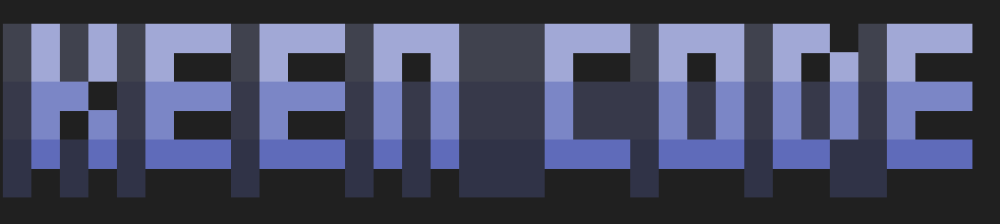

<div align="center">



[](https://github.com/mochow13/keen-code/releases/latest)
[](https://github.com/mochow13/keen-code/actions)
[](https://go.dev/)
[](https://github.com/mochow13/keen-code/blob/main/LICENSE)

<a href="https://www.producthunt.com/products/keen-code-a-cli-coding-agent?embed=true&utm_source=badge-featured&utm_medium=badge&utm_campaign=badge-keen-code" target="_blank" rel="noopener noreferrer"></a>

</div>

<div align="center">

</div>

**Keen Code** is a terminal-based AI coding agent like Claude Code or Codex CLI. Written in Go, it is simpler, lighter, minimalistic but useful coding agent for typical software engineering tasks.

Keen Code is highly opinionated. It avoids features that are not necessarily needed or useful for a regular software engineer. It tries to avoid unnecessary complexity and attempts to keep the agent harness as simple as possible.

From requirements to implementation, Keen Code was engineered using a wide range of coding agents and agentic IDEs like Cursor, Windsurf, Claude Code, OpenCode, Codex CLI, and Kimi CLI. At any given time, Keen Code was developed by a single agent, meaning, no multi-agent orchestration was used.

By far, AI coding agents are the most ubiquitous use case in the era of AI agents. The goal of the project is to showcase how coding agents can be used to develop coding agents themselves. This is why most prompts and output docs are saved as markdown files in the `.ai-interactions` directory. 

Keen Code is also an experiment to play with the *new way of working* where engineers work with AI agents to develop software. In this setting, engineers are sometimes referred to as "orchestrators".

> **Every line of code in this repo was written by an AI agent.** The full paper trail — prompts, plans, design docs — is preserved in [`.ai-interactions/`](.ai-interactions/). See [TOUR.md](TOUR.md) for the full story.

## Table of Contents

- [Features](#features)
- [Development Philosophy](#development-philosophy)
- [Development Cycle Example](#development-cycle-example)
- [Install Keen Code](#install-keen-code)
  - [Install with script](#install-with-script)
  - [Install with npm](#install-with-npm)
- [Run Keen](#run-keen)
- [Supported Providers](#supported-providers)
- [Built-in Tools](#built-in-tools)
- [How Keen Handles Context](#how-keen-handles-context)
- [Further Reading](#further-reading)


## Features

- **Multi-provider** — Anthropic, OpenAI, Codex (via OAuth), Gemini, DeepSeek, Kimi, GLM, MiniMax, OpenCode Go, and Amazon Bedrock. Switch with `/model`. More providers will be added in the future.
- **6 minimal tools** — `read_file`, `write_file`, `edit_file`, `glob`, `grep`, `bash`. Deliberately lean.
- **Skills system** — Specialized workflows for planning, debugging, refactoring, code review, and more.
- **Thinking mode** — Extended reasoning for complex tasks. Use `/thinking` to change the thinking effort level for the current model. All models that support thinking can be configured.
- **Session management** — Persistent sessions with resume capability.
- **Conservative context management** — Lean cross-turn memory via `TurnMemory` summaries instead of raw tool traces. More information can be found in [docs/turn-memory.md](docs/turn-memory.md). An analysis of the tradeoffs and rationale can be found in [docs/turn-memory-analysis.md](docs/turn-memory-analysis.md).
- **User-triggered compaction** - When the context window is nearing the limit, use `/compact` to compact the context.

## How Keen Handles Context

Keen takes a deliberately lean approach to cross-turn context. Within a single assistant turn the model has full access to its tool calls and results, but once the turn completes Keen does **not** carry the raw tool trace forward. Instead, it distills a compact `TurnMemory` summary that records only the outcomes most likely to matter later — currently which files were changed and which bash commands failed.

Subsequent turns therefore receive:

- prior user and assistant messages
- the compact `TurnMemory` summary from earlier turns
- any pending state from a turn that failed mid-loop, so the model can resume instead of starting over

The tradeoff is intentional: smaller context and a better signal-to-noise ratio, at the cost of occasionally re-reading files or re-running searches when older observations are needed again. Read-only facts are cheap to recompute; mutated state and failures are what deserve durable memory.

For the full rationale, lifecycle, and comparison with other coding agents, see [`docs/turn-memory.md`](docs/turn-memory.md).

## Development Philosophy

Developing Keen Code is guided by the following philosophy:

- All the code is written by AI agents, not humans
- The project is developed iteratively using spec-task-code-review cycle by a human engineer
- The human engineer has a very strict set of roles:
  - Specifiy and clarify the requirements
  - Review design docs and influence design decisions
  - Review changes made by the agents
    - Changes can also be reviewed by the agents themselves
  - Ensure the quality and correctness of the code
  - Focus on best practices and standards relevant to the programing language (Go in this case)
  - Thoroughly review and test the product after each iteration
  - Continously provide feedback to the agents to improve the product
- Prompts are saved as markdown files in the `.ai-interactions/prompts` directory
  - Almost all of the prompts are stored to showcase how the project evolved from the initial requirements to the current state
  - Prompts are pretty much chronologically ordered which demonstrates the thought process and iterative nature of the development
- All the outputs are saved as markdown files in the `.ai-interactions/outputs` directory
  - These outputs are basically plans, design docs, and breakdowns of the tasks
  - These outputs are the "specs" that the agents later use to implement the tasks

## Development Cycle Example

All features follow a **spec → plan → task → review** cycle. Here's a concrete example — the `read_file` tool from Phase 3:

**Spec** — [`prompts/phase-3/prompt-3_read-file-tool.md`](.ai-interactions/prompts/phase-3/prompt-3_read-file-tool.md)
Requirements defined upfront: ask permission before reading, respect FileGuard path rules, text files only, 1 MB limit, support relative and absolute paths.

**Plan** — [`outputs/phase-3/output-3_read-file-tool.md`](.ai-interactions/outputs/phase-3/output-3_read-file-tool.md)
Design doc produced by the agent: how `Guard.CheckPath` maps to the REPL permission prompt, exact struct contracts, permission flow diagram.

**Task** — [`prompts/phase-3/prompt-2_phase-3-tasks.md`](.ai-interactions/prompts/phase-3/prompt-2_phase-3-tasks.md)
Implementation broken into steps — tool contract, permission bridge, REPL selector, unit tests — each approved before the next began.

**Review** — (inline feedback during implementation)
The LLM was rejecting `.go` files because MIME detection flagged them as binary. Review caught this; switched to character-based text validation. The fix landed in the same iteration.

## Install Keen Code
### Install with script

```bash
curl -fsSL https://raw.githubusercontent.com/mochow13/keen-code/main/scripts/install.sh | bash
```

To pin a specific version:

```bash
curl -fsSL https://raw.githubusercontent.com/mochow13/keen-code/main/scripts/install.sh | bash -s -- -v v0.16.1
```

Installs to `/usr/local/bin` if writable, otherwise `$HOME/.local/bin`.

### Install with `npm`

Install the CLI globally:

```bash
npm install -g keen-code
```

Check that the install worked:

```bash
keen --version
which keen
```

You can also run it without a global install:

```bash
npx keen-code --version
```

## Run Keen

Start Keen in your current directory:

```bash
keen
```

## Supported Providers

- Anthropic
- OpenAI
- Codex (ChatGPT OAuth)
- Google AI (Gemini)
- Moonshot AI (Kimi)
- DeepSeek
- Z.ai (GLM)
- MiniMax
- OpenCode Go
- Amazon Bedrock

> Use `/model` to switch providers. The ChatGPT/Codex option opens a browser-based OpenAI sign-in flow and stores OAuth credentials in `~/.keen/auth.json`.

MiniMax uses its Anthropic-compatible API and includes MiniMax M2.7 and M2.5.
OpenCode Go uses an API key and includes GLM, Kimi, DeepSeek, MiMo, MiniMax, and Qwen models.

## Built-in Tools

Keen Code aims to support minimal set of useful tools for coding. Currently, these tools are built in:

- `read_file` — read a UTF-8 text file
- `glob` — find files by glob patterns
- `grep` — search for text patterns in files
- `write_file` — create or overwrite files
- `edit_file` — replace specific text in existing files
- `bash` — run shell commands

## Further Reading

- [TOUR.md](TOUR.md) — the full story of how this project was built
- [CHANGELOG.md](CHANGELOG.md) — release history
- [ROADMAP.md](ROADMAP.md) — what's planned next
- [CONTRIBUTING.md](CONTRIBUTING.md) — how to contribute
- [`docs/`](docs/) — architecture, tools, sessions, skills, and more
